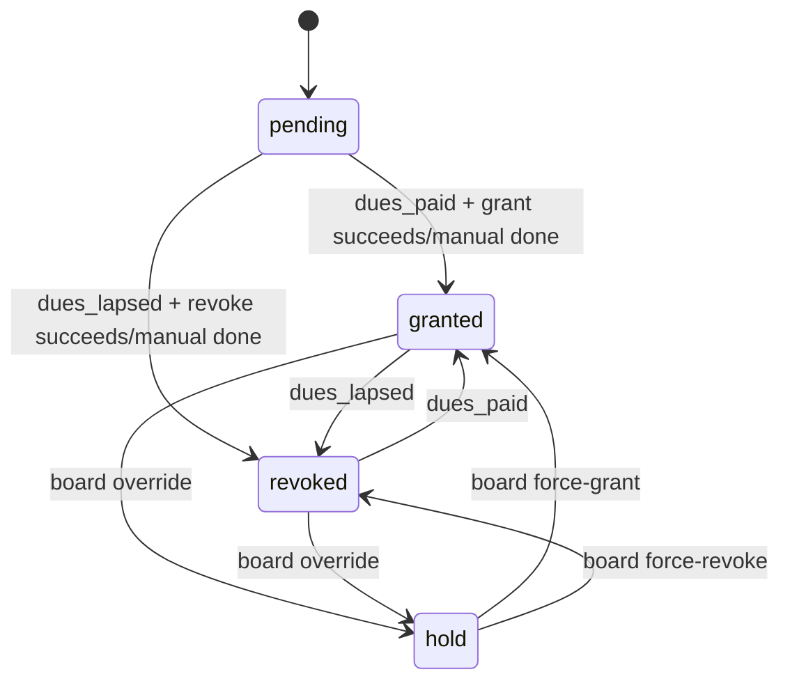
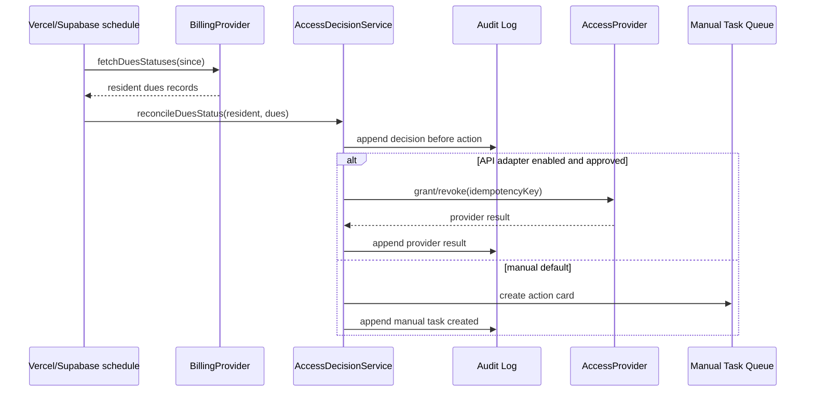

# Architecture

## Data model

- `profiles`: board/resident role mapped to Supabase users.
- `residents`: resident registry, dues status, access status, external references, last sync.
- `audit_log`: append-only ledger of all decisions and mutations.
- `manual_tasks`: human-in-the-loop cards for external systems when no approved API exists.
- `requests`: inbound email/request triage queue.
- `idempotency_keys`: retry guard for webhooks/syncs.

## Access status state machine

Rules:

- Dues paid means desired access is `granted` unless a board override puts the resident on `hold`.
- Dues lapsed means desired access is `revoked` unless the board explicitly force-grants with a reason.
- Every transition requires an audit row before provider action.
- Provider action is idempotent and records an idempotency key.

## Dues-change sequence

## ACC data model notes

ACC review data is modeled separately from the general inbound `requests` triage queue so Architectural Control Committee activity can be audited and permissioned independently while still retaining the originating email context.

- `acc_requests`: canonical ACC audit records created from HOA website form emails. Each row should retain the inbound email linkage, such as source/provider message ID and received timestamp, plus structured request fields for the property, requester/contact information, project description, status, committee notes, and timestamps. Updates to request fields should be reflected in `audit_log` so the ACC review trail remains reconstructable.
- `acc_request_votes`: committee vote records associated with `acc_requests`. Rows represent individual committee-member decisions and vote metadata, such as vote value, comments, voter profile, and timestamp. Vote changes are ACC write activity and should be audited.
- `acc_committee_members`: membership/authorization table that maps Supabase profiles to ACC committee participation. It is the source of truth for determining who can access the ACC audit tab and who has ACC write privileges.

ACC-specific Row Level Security should layer on top of the general board role model:

- ACC committee members can read ACC requests, update committee-owned request fields, and create or update their own vote records.
- Committee-only users can access ACC audit workflows but cannot read unrelated operational dashboards, resident access tooling, dues workflows, or non-ACC triage data unless another role grants that access.
- Board members can read ACC requests for oversight even when they are not listed in `acc_committee_members`.
- Board members who are not ACC committee members must not update ACC request fields and must not insert, update, or delete ACC vote rows.
- ACC write policies should validate membership through `acc_committee_members` rather than trusting client-side tab visibility.

Inbound email ingestion remains the entry point for website-submitted ACC requests. The website form forwards an email to the HOA inbox, the inbox forwarding service posts that message to `/api/email`, and classification/routing logic identifies ACC submissions and creates or links the corresponding `acc_requests` row. The original inbound email should remain traceable through the general email workflow metadata so retries stay idempotent and the ACC audit record can be reconciled back to the source message.

