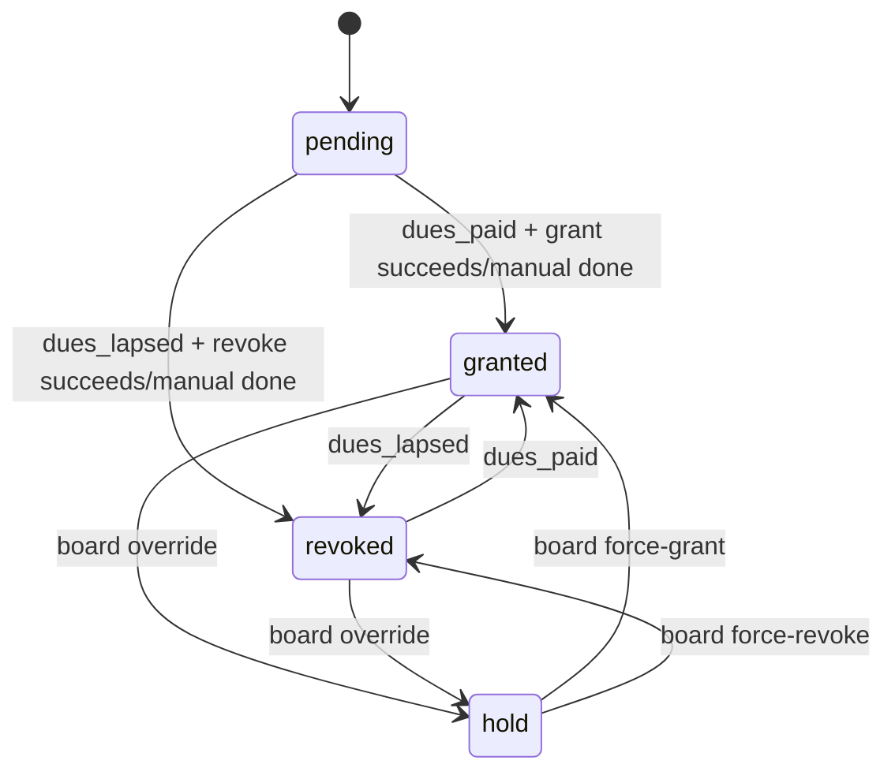
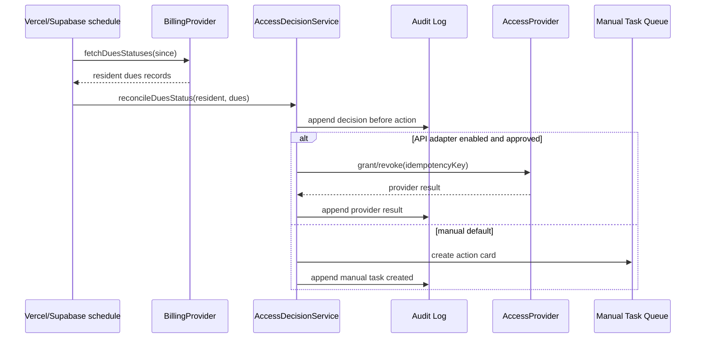

# Architecture

## Data model

- `profiles`: board/resident role mapped to Supabase users.
- `residents`: resident registry, dues status, access status, external references, last sync.
- `audit_log`: append-only ledger of all decisions and mutations.
- `manual_tasks`: human-in-the-loop cards for external systems when no approved API exists.
- `requests`: inbound email/request triage queue.
- `idempotency_keys`: retry guard for webhooks/syncs.

## Access status state machine

Rules:

- Dues paid means desired access is `granted` unless a board override puts the resident on `hold`.
- Dues lapsed means desired access is `revoked` unless the board explicitly force-grants with a reason.
- Every transition requires an audit row before provider action.
- Provider action is idempotent and records an idempotency key.

## Dues-change sequence

